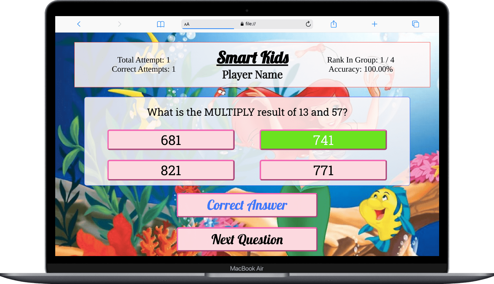
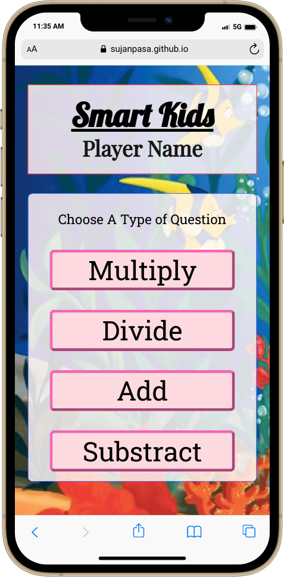
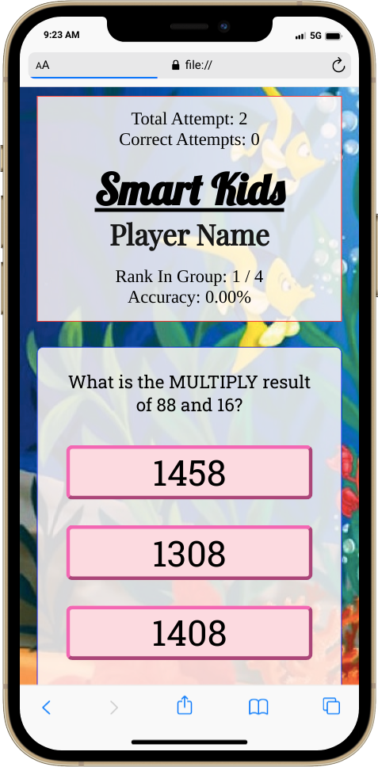
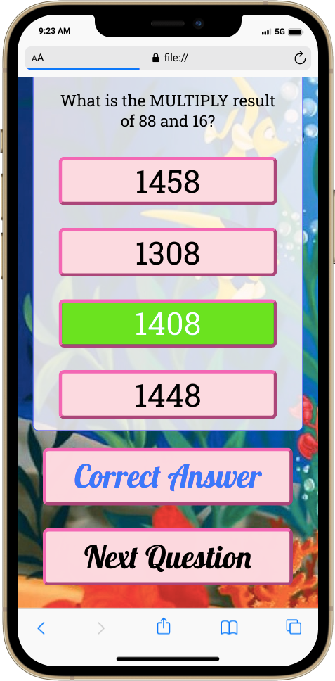

# Smart Kids (Maths)

&nbsp;
&nbsp;

## Description:
Smart kids is a educational game that is built for primary level children to engage them in educational materials in free time to keep practising.

## Motivation for the project
During lockdown my younger sister age 10 was attendng online class and not able to have proper attention on studies and was quite bored on the subject matters so I tried this concept and she along with her friends loved to play the game rather than other excercises that I gave them on the paper.

## Technologies Used:
- HTML
- css
- Javascript

## How it works
Random numbers are generated for each qustions and based on correct answer wrong answers are generated which are then placed randomly in the answer section. On choosing a answer and after checking it will show if you have choosen correct or wrong answer and also update the accuracy, number of total question attemped and correct attempts

## Further Plans
I want to make it a game with leaderboard which will create a healthy competitive environment among friends but for that I still need to learn more stuffs. Soon it will be updated with a leaderboard and backend for it. 